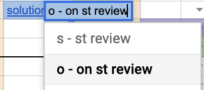
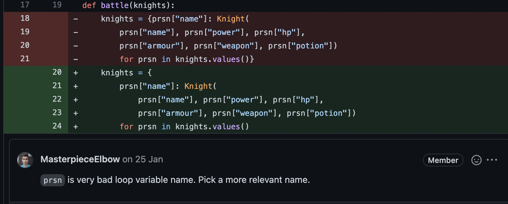

# Students review guideline

### **Remember!**

**It's okay if the code you are checking differs from your own code. The main thing is that all requirements are fulfilled.**

## Student's review example

1. Set status "o - on st review".                           
    
2. Check if the tests are passed.
    
3. We're reviewing work, following the checklist. If you find some mistakes, add the comment about this mistake.
    
4.  So we've found some incorrect variable names here. If incorrect name of variables are found, you should report this and ask for changes.
    
5. After fulfil checking by checklist, finish your review and by choose one of the variant (Request changes or Approve).
    
6. Check homework's status on the table.                               
    

## How to use statuses

1. When you send your homework, the status **"s - st review"** is assigned to it automatically, you don't need to set it by yourself. 
2. Only if you've done your homework, you can review the other student's homework. Set the status **“o - on st review”** at the review's beginning.
3. After student's review, you received the status **“0 - reject”** (it’s assigned automatically after rejecting on the GitHub). You have to fix your work, and then set the status **“a - again st review”**.
4. After student's review, you received the status **“r - mentor review”** (it’s assigned automatically after approval on the GitHub). You just wait for the mentor review.
5. After mentor’s review, you received the status **“0 - reject”** (it’s assigned automatically after rejecting on the GitHub). You have to fix your work, and then set the status **“r - mentor review”**.
6. After mentor’s review, you received the status **“1 - mt approved”** (it’s assigned automatically after approval on the GitHub). That means your homework is accepted.

## Check list for student's review

1. The tests are passed.
2. All task conditions are met if there are no tests in the task.
3. The correct code spelling, by the recommendation on [PEP 8](https://peps.python.org/pep-0008/).
4. Using best practices from lectures and videos. Also using DRY and other principles.
5. The correct name of the variables(classes, functions, etc.) and the absence of spelling errors.
6. Correct naming for commits.
7. **IMPORTANT** Simple is better than complex. Using [PEP 20 The Zen of Python](https://peps.python.org/pep-0020/).

## Recommendation how to report an error

1. It's okay if you miss some errors, and the mentor has found them after your review. But remember, it will be good if you find them right now.
2. Add simple and correct description of the problem if you find one.
3. You should try to explain how to fix this error.
4. If it's necessary, and you know the source, you can add link on solving this problem.
5. When you are not sure if it's a problem or not, or you don't know how to explain it, you can always refer to the mentor in the chat to clarify this.
